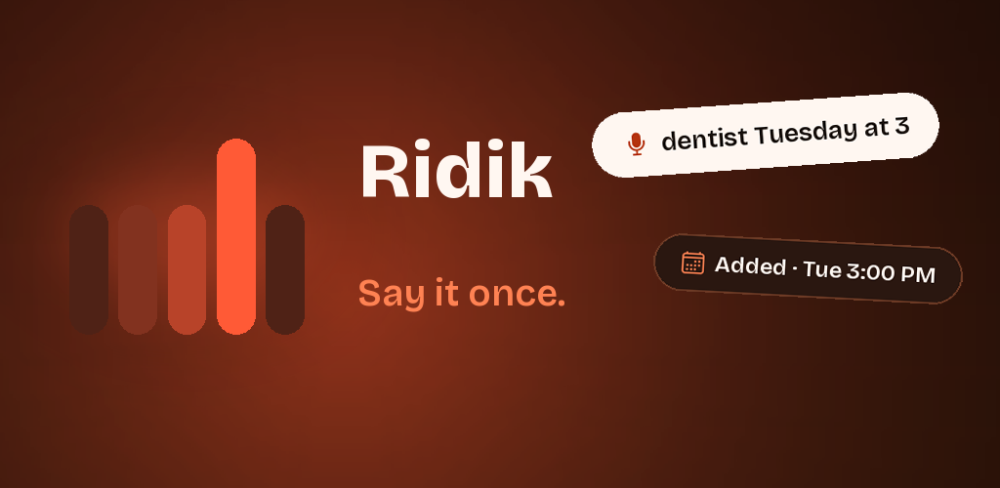
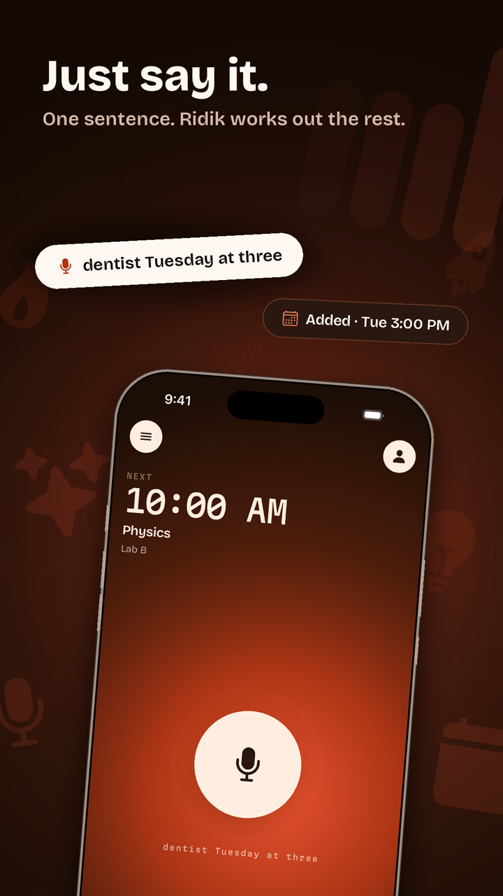
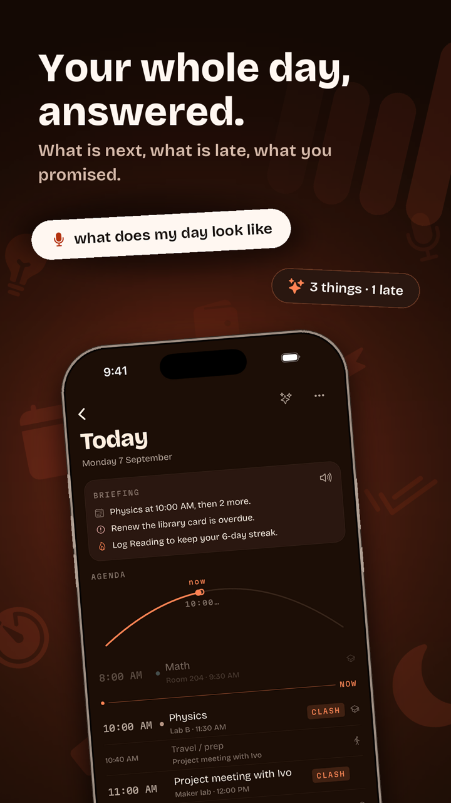
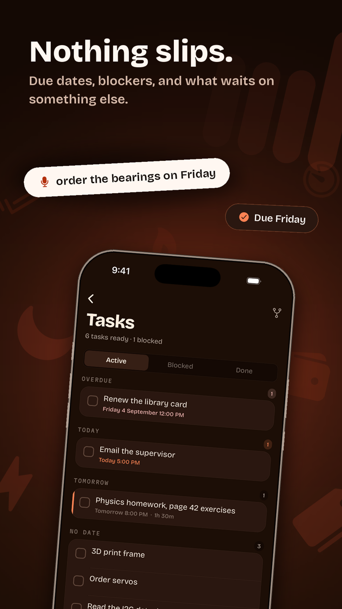
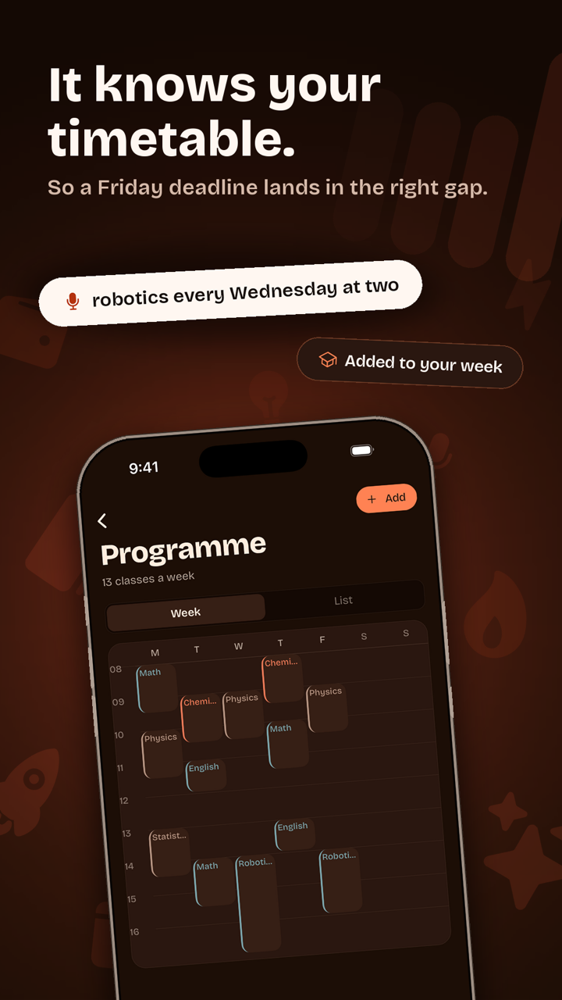
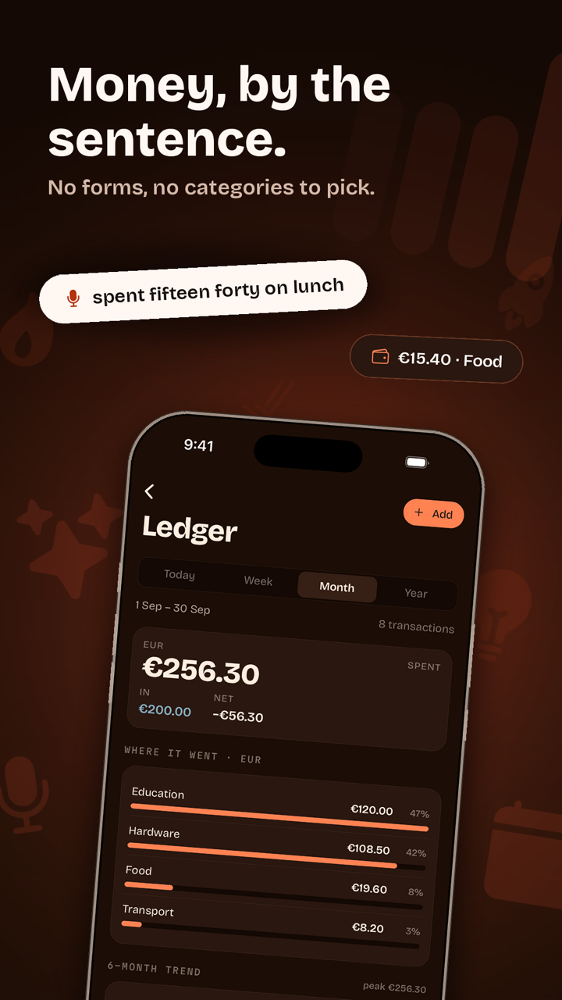
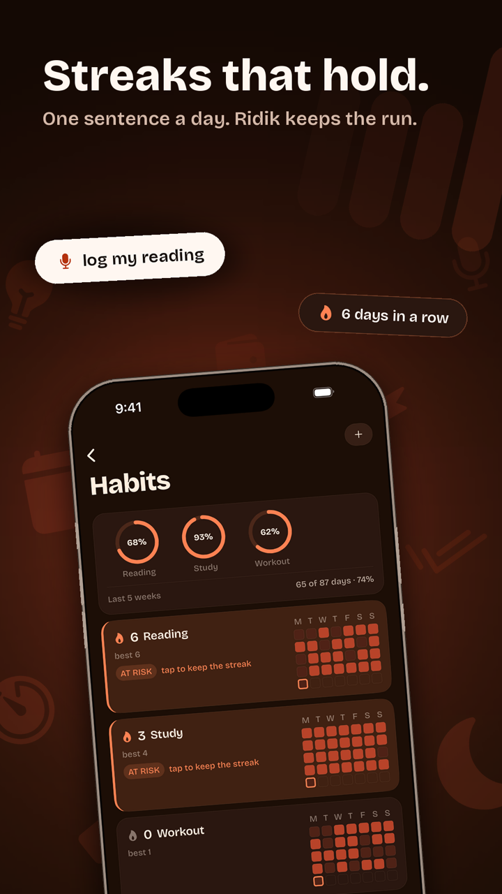
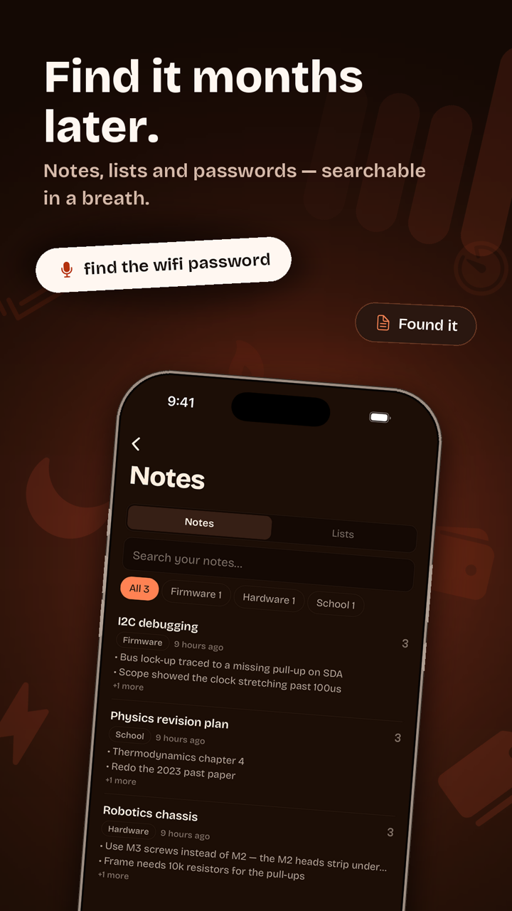
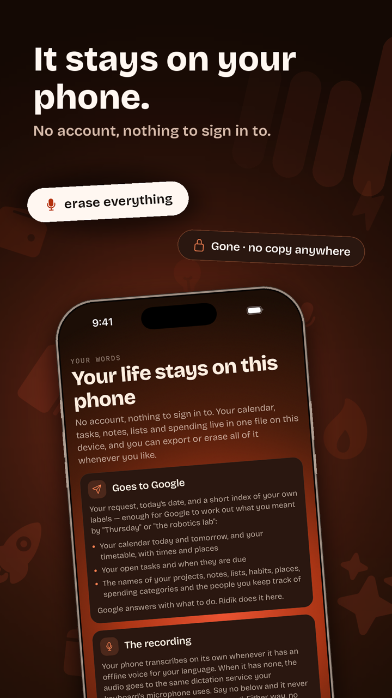

  

<h3 align="center">Say it once. Ridik files it.</h3>

  A voice-first organiser for iPhone and Android. 
  One sentence becomes a calendar event, a task, a note, a list item or an expense — 
  with no account, and your life kept on your phone.

---

## The idea

Organiser apps make you do the organising: pick the app, find the screen, fill the form.
Ridik is **one microphone**. You talk the way you'd talk to a friend, and it works out
where everything goes.

> *"Remind me to call Ivo at 4, cancel my Math homework for Sunday, and note that the
> robotics lab needs 10k resistors."*

→ **three** separate actions, each reported back, each one tap to undo.

<table>
  <tr>
    <td></td>
    <td></td>
    <td></td>
    <td></td>
  </tr>
  <tr>
    <td></td>
    <td></td>
    <td></td>
    <td></td>
  </tr>
</table>

## What it does

| You say | Ridik does |
| --- | --- |
| "dentist Tuesday at three" | Adds it to your calendar, and warns you if it clashes with something |
| "what does my day look like" | Reads back what's next, what's late and what you promised |
| "I can't solder the board until the bearings arrive" | Links the two tasks; the blocked one waits until it's unblocked |
| "homework for Math, page 42" | Due the day before your next Math class — it knows your timetable |
| "spent fifteen forty on lunch" | Logs €15.40 under Food |
| "log my reading" | Keeps your streak going |
| "find the wifi password" | Searches your notes |

Plus a daily spoken briefing, location reminders, focus timers, people & promises, and
**home-screen widgets on both platforms** with a mic button that starts recording directly.

## Built to be trusted

- **It shows its work.** Every turn ends with a receipt of exactly what changed, with Undo.
  Anything irreversible asks first — and if it isn't sure what it heard, it asks rather than guesses.
- **No account. One file on your phone.** Export it any time; restoring a backup only ever
  *adds*, never overwrites.
- **Honest about the network.** Before anything leaves the phone, a first-run screen names every
  company that could receive data and what they get. Say no and the app still works — an
  offline engine files simple sentences on-device.
- **On-device speech where possible.** Apple's `SpeechAnalyzer` on iOS 26, and a local
  whisper.cpp model as an upgrade that transcribes without uploading audio.
- **Free where it's free.** Everything local is free forever. Only requests to the AI model are
  metered — 25 free to try, then a small monthly plan.

## Under the hood

**Expo SDK 57 · React Native · TypeScript · SQLite + Drizzle · Gemini (behind a swappable
provider) · native Swift & Kotlin widgets · RevenueCat**

- The model never touches the database directly — it proposes typed actions (validated with Zod)
  and a local executor applies them.
- Ambiguous matches return *"I don't know"* instead of a best guess, so a misheard name can't
  silently edit the wrong thing.
- 150+ test files, with the data layer tested against real SQLite rather than mocks.

Running it, the architecture and the design rules: **[DEVELOPING.md](DEVELOPING.md)** ·
[AGENTS.md](AGENTS.md) · [WIDGETS.md](WIDGETS.md) · [Privacy policy](docs/privacy.md)

## Licence

MIT — see [LICENSE](LICENSE).
